# 曲线纹理 2d CurveTexture2d

基于 CocosCreater 实现的 2d 的曲线纹理,可在编辑器中实时编辑.  
The 2d curve texture based on CocosCreater can be edited in real time in the editor

```
新的 3.8.x / 2.4.x 版本插件很快就提交商店,此文档对应新的3.8.x版本插件
```

## 如何获取 How to get it

1. 在 [Cocos Store](https://store.cocos.com) 中搜索 soida/曲线纹理/CurveTexture/curve 等关键字即可看到.
2. 此插件目前支持 CocosCreater 3.8.x 系列的版本,其它 3.x 的版本暂未测试,你也可以试试.
3. 下载或者安装后(或许需要重启编辑器),在某个节点的`属性检查器`中点击最下方的按钮 `添加组件/add component`,搜索`CurveTexture2d/曲线纹理2d`即可添加成功. 见下图:

<p align="center">
  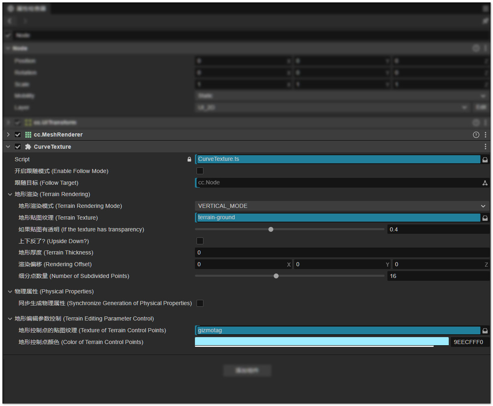
</p>

## 如何使用 how to use it

1. 需要提前对编辑器进行如下设置,方便后续操作.
   <p align="center">
   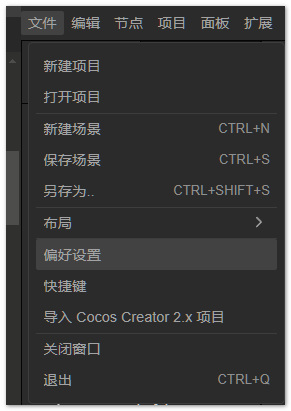
   </p>
          <p align="center">
     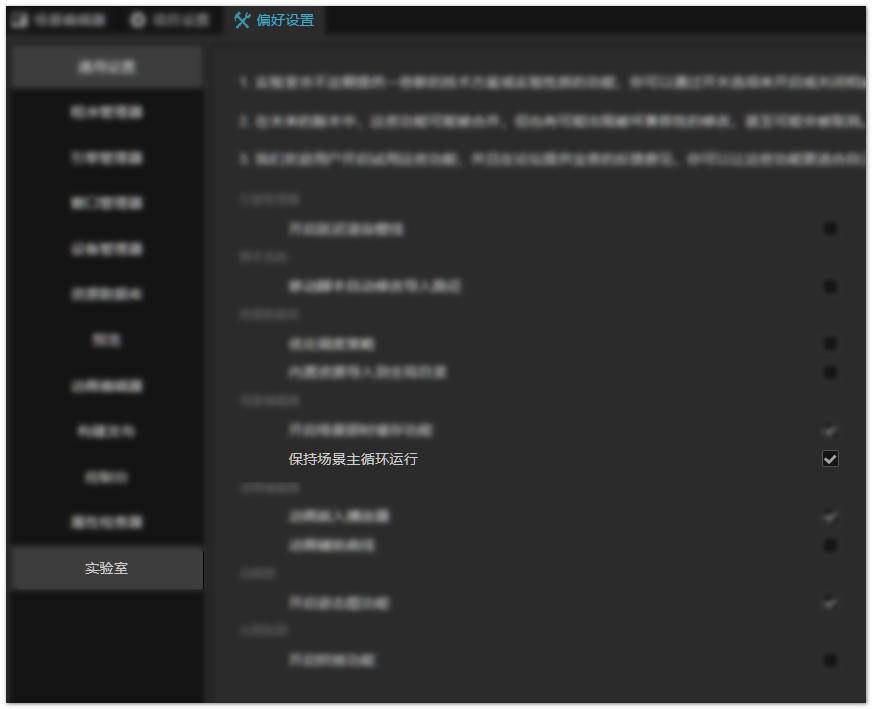
   </p>
2. 如果你已经成功添加`CurveTexture`组件,恭喜你,成功了一半.
3. 你会看到伴随`CurveTexture`组件同时自动添加了一个`cc.MeshRenderer`组件,不用设置它,让它在那里就行.
4. 现在,画面中还没有任何改变.按照下面操作添加对应贴图:

<!-- 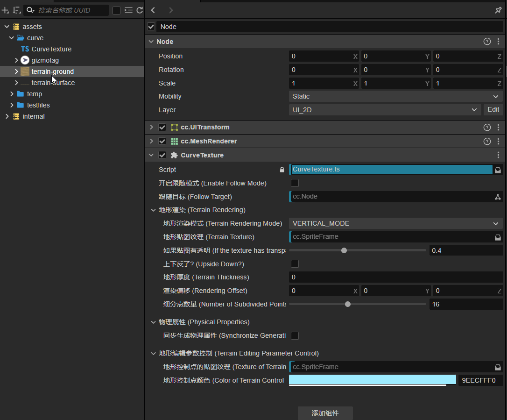 -->
<p align="center">
  
</p>

4. 现在你可以在`场景编辑器`中看到如下画面

   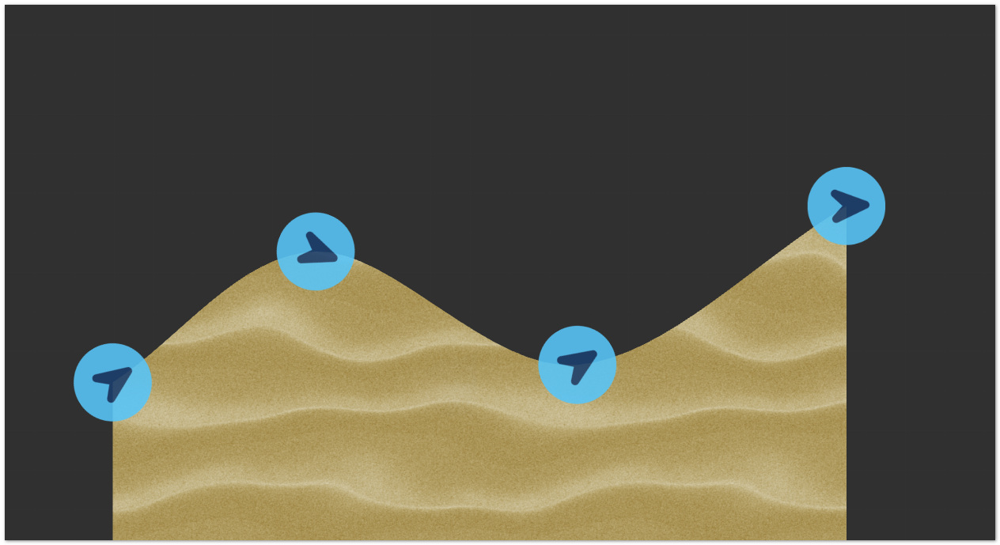

5. 调整一个或者多个控制点
    <p align="center">
     
   </p>

6. 新增一个或者多个控制点`(Ctrl+D)`
   

7. 因为控制点都是节点类型,所以可以直接使用编辑器已存在的对齐功能:
<p align="center">
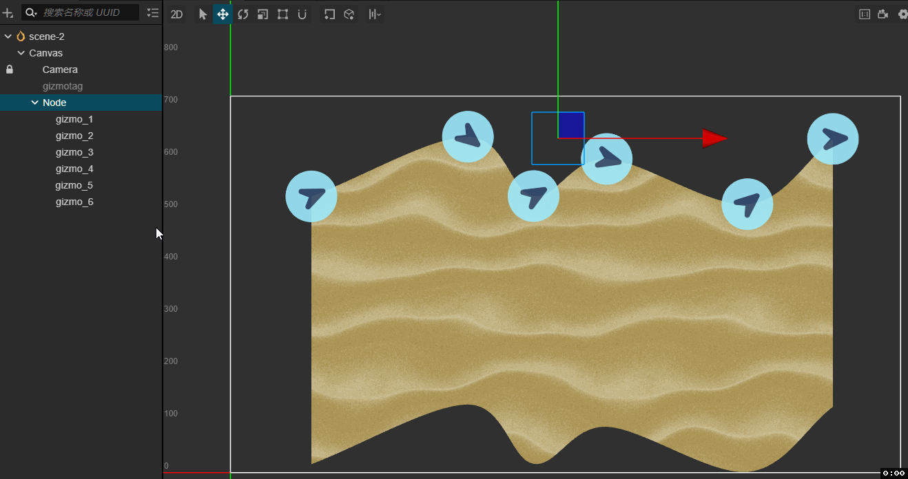
</p>

8. 不用担心这些控制点,它们会在实际运行的时候被清除掉.
   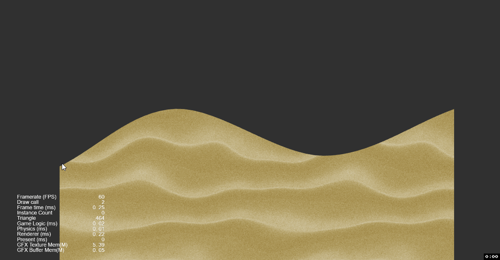
9. 如果你要替换为自己的纹理,请确保`纹理的宽和高都是2的幂` ,比如 `512*512` / `256*64`:
<p align="center">
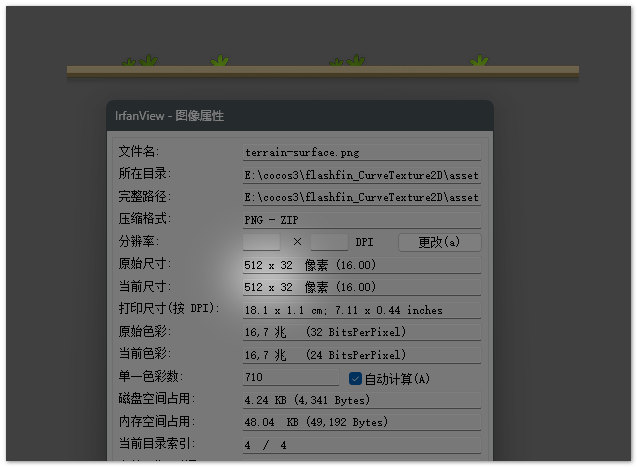
</p>

10. 如果你觉纹理显示的效果上下颠倒了,可以尝试调整`Upside Down`
11. 如果你的纹理显示的效果透明部分有异常,可以尝试调整 `If the texture has transparency`
12. CurveTexture 组件有两种模式,`VERTICAL_MODE` 和 `TANGENT_MODE`

- `VERTICAL_MODE` 用来渲染厚的纹理(也就是纹理的高度属性),比如地形.

<p align="center">
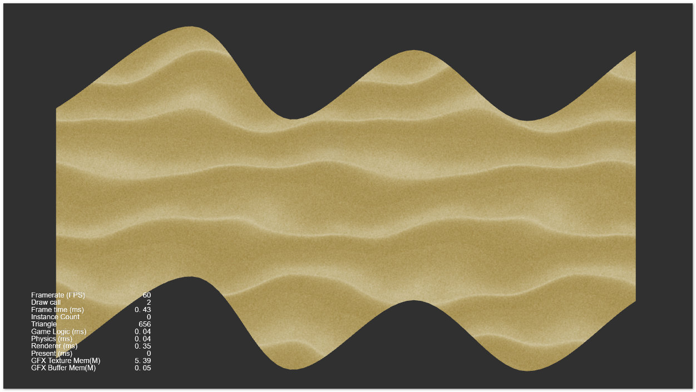
</p>

- `TANGENT_MODE` 用来渲染薄的纹理,比如绳子,地形表面等.
<p align="center">
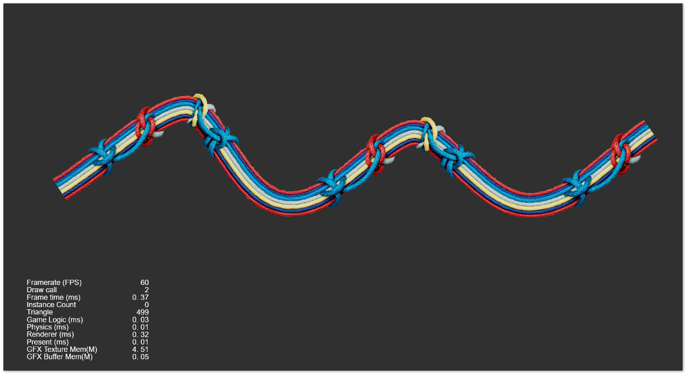
</p>
  <p align="center">
  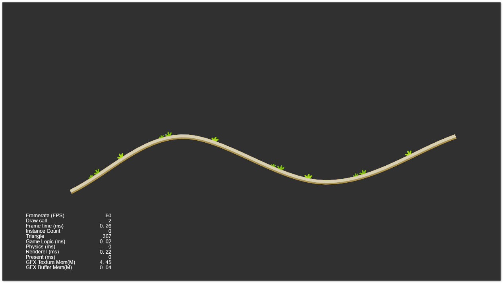
</p>

13. 地形厚度参数,只存在于`VERTICAL_MODE`

- 默认为 0,即为保持纹理原始厚度(高度)
- 如果手动调节,效果:
<p align="center">
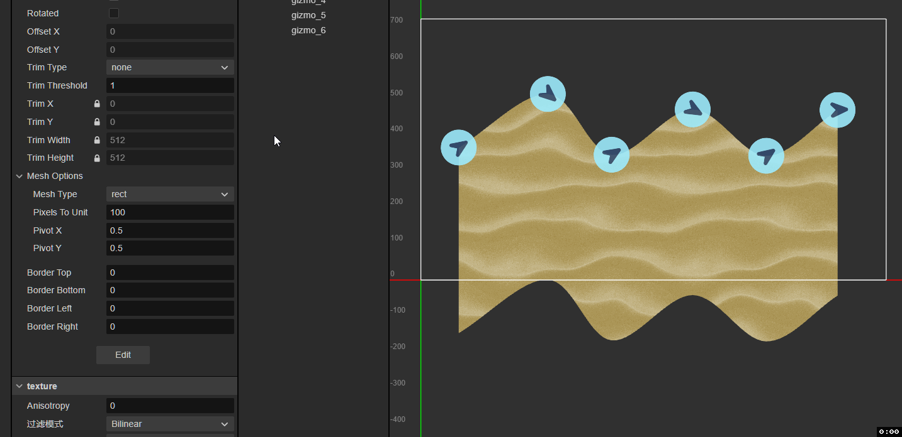
</p>

14. 渲染偏移参数
<p align="center">
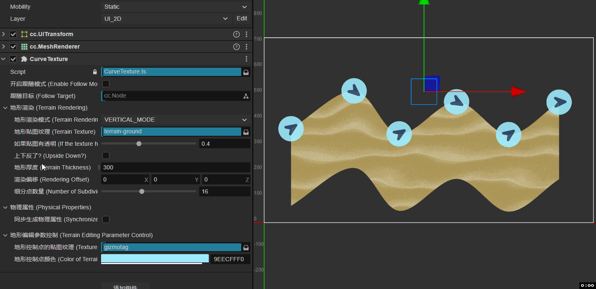
</p>

15. 细分点数量
<p align="center">
   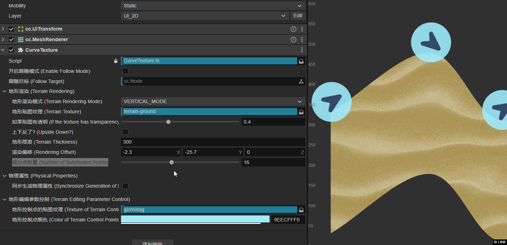
   </p>

16. 同步生成物理碰撞组件,同时调节偏移值
<p align="center">
   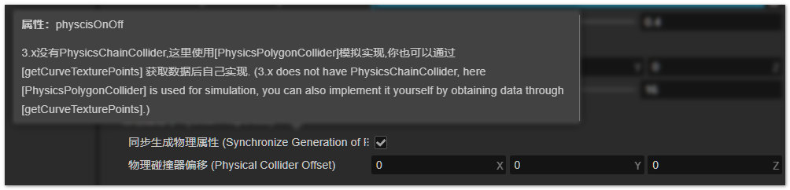
   </p>
   <p align="center">
   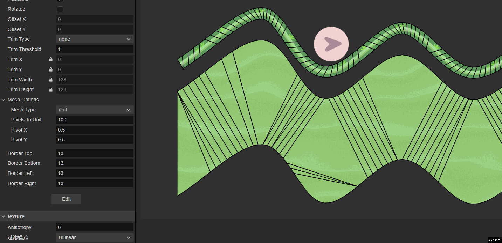
   </p>

17. 地形控制点颜色,当场景中有多个`CurveTexture`组件节点时,为了区分:
<p align="center">
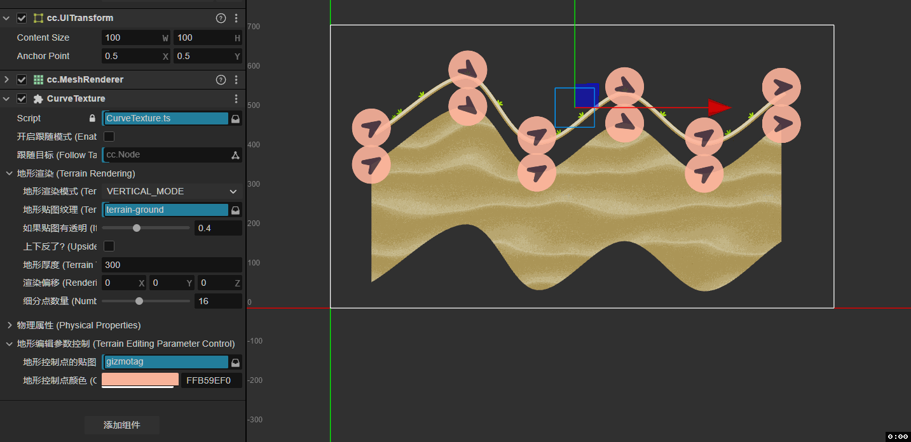
</p>

18. 地形控制点的贴图纹理,可以根据需要更换
<p align="center">
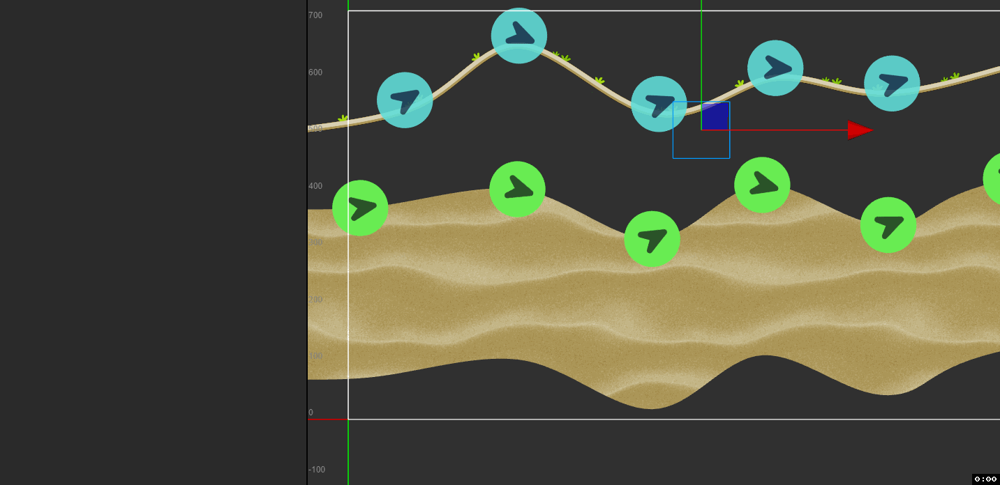
</p>

19. `开启跟随模式`,将另一个`CurveTexture`组件节点作为`跟随目标`
<p align="center">
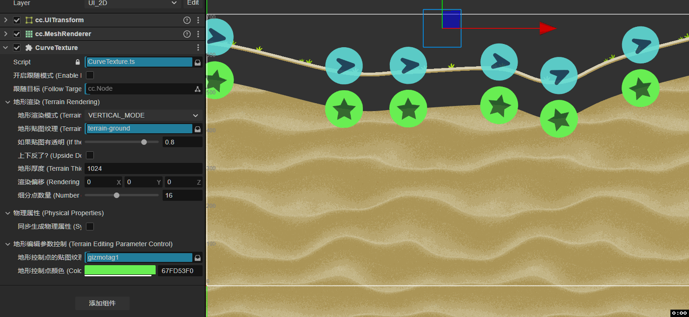
</p>

20. 是否显示控制点
<p align="center">
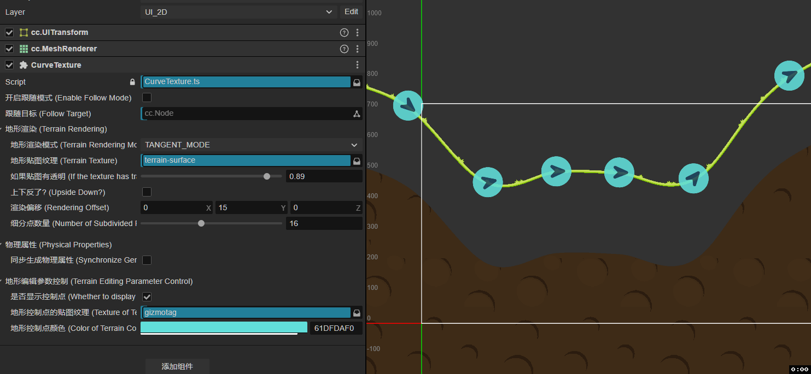
</p>
