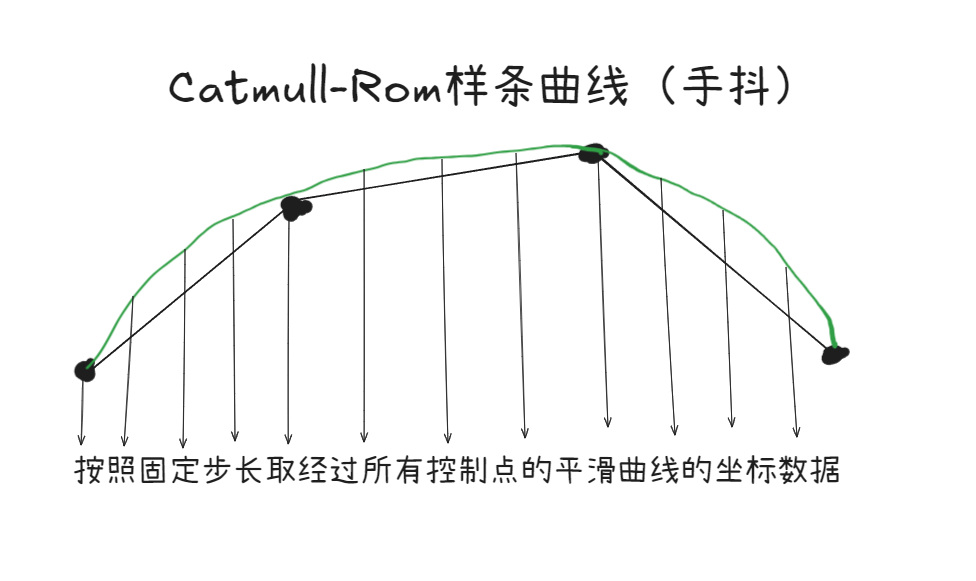

# CurveTexture2D 可编辑曲线纹理组件 实现原理小分享

## 1. 插件简介

CurveTexture2D 组件插件的开发来源于经典的 2D 横版赛车游戏《登山赛车》（Hill Climb Racing），以及独立游戏《Old Man's Journey》。在这类游戏中，地形通常由平滑的曲线构成，玩家驾驶车辆或操控角色在各种起伏的地形上探索。正好 CocosCreater 发布了体验大幅提升的 3.8.6 版本,那就实现一个吧。

### 登山赛车


### 回忆之旅/Old man's journey


提前体验功能： https://soidaken.github.io/flashfin_CurveTexture2D_Presentation/  
B 站简单使用视频： https://www.bilibili.com/video/BV1Xb5KzZEQD  
插件商店地址（3.x 版本）： https://store.cocos.com/app/detail/7632  
插件商店地址（2.4.x 版本）：https://store.cocos.com/app/detail/3842

## 2. 主要功能与应用场景

### 主要功能

- **曲线地形编辑**：通过可视化控制点，快速绘制和调整地形轮廓。
- **自动曲线细分**：采用 Catmull-Rom 样条算法，实现地形曲线的平滑插值。
- **Mesh 自动生成**：根据曲线自动生成可用于渲染的 Mesh 数据，支持不同渲染模式（竖直/切线）。
- **UV 映射与纹理支持**：支持自定义地形纹理，自动计算 UV 坐标，实现地形贴图平铺或拉伸。
- **物理碰撞体同步**：可一键生成与地形形状一致的 2D PolygonCollider2D，方便物理交互。
- **编辑器可视化扩展**：支持在 CocosCreator 编辑器中实时预览和调整地形，提升开发效率。
- **多节点同步**：支持地形数据在多个节点间同步，便于复杂场景的地形复用。

### 应用场景

- 2D 横版赛车、摩托、滑雪等需要曲线地形的游戏。
- 2D 跑酷、冒险、动作等需要自定义地形的项目。
- 需要动态生成或编辑地形的关卡编辑器工具。
- 其他任何需要高自由度 2D 曲线地形的 CocosCreator 项目。

## 3. 组件属性详解

CurveTexture2D 组件暴露了丰富的属性，方便使用者灵活配置数据。以下为主要属性说明：

- **同步模式 (syncOnOff, syncTarget)** 是否自动实时同步另一个节点的细分数据，实现多节点地形复用。
- **渲染属性**
  - **渲染模式 (renderMode)** 支持竖直模式（VERTICAL_MODE）和切线模式（TANGENT_MODE），影响地形厚度和贴图方式。
  - **渲染纹理 (spFrame)** 地形使用的主纹理，支持自定义贴图。
  - **渲染厚度 (thickness)** 地形的厚度，0 表示自动使用纹理高度。仅竖直模式下可调。
  - **渲染偏移 (offset)** 地形整体的渲染偏移量。
  - **透明度阈值 (alphaThreshold)** 处理带透明通道纹理时的透明度阈值。
  - **纹理上下反转 (updownFix)** 贴图渲染方向是否上下反转。
  - **细分点数量 (smoothness)** 控制每两控制点之间的曲线细分数量，数值越大曲线越平滑。
- **控制点属性**

  - **控制点 (controlPoints)** 编辑地形轮廓的关键点，可在编辑器中可视化拖动。
  - **控制点显示/隐藏 (gizmoVisibleOnOff)** 是否在编辑器中显示控制点辅助图形。
  - **控制点纹理 (gizmoTag)** 控制点的可视化 SpriteFrame 资源。
  - **控制点颜色 (gizmoColor)** 控制点 Gizmo 的颜色。
  - **运行时编辑 (editWhenRun)** 是否允许在运行时编辑控制点。
  - **是否在 x 轴方向排序(sortInXDirection)** 是否在 x 方向上自动排序。

- **物理属性相关**
  - **同步生成物理属性 (physcisOnOff)** 是否自动生成与地形一致的 PolygonCollider2D。
  - **物理碰撞器厚度 (physicsThickness)** 物理碰撞体的厚度，0 表示自动使用纹理高度。
  - **物理碰撞器偏移 (offsetCollider)** 物理碰撞体的偏移量。

> 通过合理配置上述属性，可以满足绝大多数 2D 曲线地形的制作需求。

## 4. 用到的引擎自带的组件

- **MeshRenderer**：负责将 Mesh（网格）渲染到场景中。通过设置 Mesh 数据和材质，可以实现自定义的地形外观。[（官方介绍）](https://docs.cocos.com/creator/3.8/manual/zh/engine/renderable/model-component.html)
- **Mesh**：包含顶点、UV、法线、索引等信息的数据结构，是地形渲染的基础。
- **PolygonCollider2D**：用于同步生成与地形形状一致的碰撞体，实现物理交互。

  **使出了我仅有的绘画功底，简单描述了这个组件(我)做了什么(绿色部分)：**

  

## 5. 控制点编辑与曲线平滑细分

### 控制点编辑

- 在编辑器中，每个控制点以可视化 Gizmo 节点的形式展示，支持拖拽、增删和排序。
- 支持 X 轴方向自动排序，避免控制点交叉导致地形异常。
- 控制点的颜色、纹理可自定义，提升编辑体验。
  

### 曲线平滑细分功能

- 插件采用 Catmull-Rom 样条曲线对控制点进行插值，生成平滑的地形轮廓。
- 每两控制点之间可自定义细分点数量（smoothness），数值越大曲线越平滑。
- 对于仅有两个控制点的情况，采用线性插值，保证地形连续性。

**我的绘画还是有点功底的**



**核心代码片段：控制点细分与插值**

```typescript
private _generateSegmentVertex(seg_count: number = 8) {
  this._vertexesSegment.length = 0;
  const points = this._controlPoints;
  const pointCount = points.length;

  if (pointCount < 2) {
    if (pointCount === 1) {
      this._vertexesSegment.push(points[0].clone());
    }
    return;
  }

  if (pointCount === 2) {
    const p0 = points[0];
    const p1 = points[1];
    const dist = p0.clone().subtract(p1).length();
    let seg = seg_count;
    while (seg > 1 && dist / seg < this._minSegmentLength) {
      seg = Math.floor(seg / 2);
    }
    this._vertexesSegment.push(p0.clone());
    const step = 1 / seg;
    for (let i = 1; i < seg; i++) {
      const t = i * step;
      this._vertexesSegment.push(p0.clone().lerp(p1, t));
    }
    this._vertexesSegment.push(p1.clone());
    return;
  }

  // 使用Catmull-Rom样条平滑插值
  const paddedPoints: Vec3[] = [];
  paddedPoints.push(points[0].clone().add(points[0].clone().subtract(points[1])));
  paddedPoints.push(...points);
  paddedPoints.push(points[pointCount - 1].clone().add(points[pointCount - 1].clone().subtract(points[pointCount - 2])));

  for (let i = 0; i < pointCount - 1; i++) {
    const p0 = paddedPoints[i];
    const p1 = paddedPoints[i + 1];
    const p2 = paddedPoints[i + 2];
    const p3 = paddedPoints[i + 3];

    if (i === 0) {
      this._vertexesSegment.push(p1.clone());
    }

    const dist = p1.clone().subtract(p2).length();
    let seg = seg_count;
    while (seg > 1 && dist / seg < this._minSegmentLength) {
      seg = Math.floor(seg / 2);
    }

    const step = 1 / seg;
    for (let j = 1; j <= seg; j++) {
      const t = j * step;
      const interpolatedPoint = this._catmullRom(p0, p1, p2, p3, t);
      this._vertexesSegment.push(interpolatedPoint);
    }
  }
}
```

### 细分点去重与异常处理

- 插值后自动去除重复或异常点，保证地形数据稳定。
- 过滤掉非有限数值和零点，避免渲染和物理异常。

**核心代码片段：去重与过滤**

```typescript
for (let i = this._vertexesSegment.length - 1; i > 0; i--) {
  if (isCloseToVec3(this._vertexesSegment[i], this._vertexesSegment[i - 1], 2)) {
    this._vertexesSegment.splice(i, 1);
  }
}
this._vertexesSegment = this._vertexesSegment.filter((v) => isFinite(v.x) && isFinite(v.y) && (v.x !== 0 || v.y !== 0));
```

## 6. Mesh 生成与 UV 映射

### Mesh 顶点与三角形索引生成

- 根据细分后的曲线点，结合渲染模式（竖直/切线），自动生成 Mesh 顶点。
- 竖直模式下，每个曲线点向下生成厚度顶点，切线模式下则沿法线方向生成厚度顶点。
- 顶点按三角形顺序组装，形成完整的地形 Mesh。

**代码片段：Mesh 顶点生成（竖直模式）**


```typescript
if (this._renderMode == TerrainRenderMode.VERTICAL_MODE) {
  for (let index = 0; index < temp.length - 1; index++) {
    const item1 = temp[index];
    const item2 = temp[index + 1];
    const item1_bottom = item1.clone().add(v3(0, -this._curve_height_result, 0));
    const item2_bottom = item2.clone().add(v3(0, -this._curve_height_result, 0));
    this._vertexes.push(item1);
    this._vertexes.push(item1_bottom);
    this._vertexes.push(item2);
    this._vertexes.push(item1_bottom);
    this._vertexes.push(item2_bottom);
    this._vertexes.push(item2);
  }
}
```

**代码片段：Mesh 顶点生成（切线模式）**


```typescript
if (this._renderMode == TerrainRenderMode.TANGENT_MODE) {
  for (let index = 0; index < temp.length; index++) {
    const t_current = temp[index];
    if (index == temp.length - 1) {
      this._vertexes.push(t_current);
      break;
    }
    const t_next = temp[index + 1];
    const len = t_current.clone().subtract(t_next).length();
    const sinValue = (t_next.y - t_current.y) / len;
    const cosValue = (t_next.x - t_current.x) / len;
    const CX = t_current.x + this._curve_height * sinValue;
    const CY = t_current.y - this._curve_height * cosValue;
    const first_vertical_pos = v2(CX, CY);
    const second_vertical_pos = v2(CX, CY).add(t_next.clone().subtract(t_current).toVec2());

    if (index === 0) {
      this._vertexes.push(t_current);
      this._vertexes.push(first_vertical_pos.toVec3());
      this._vertexes.push(t_next);
      this._vertexes.push(second_vertical_pos.toVec3());
    } else {
      // 内凹/外凸等连接点处理略，详见组件详细代码
      // 这里只展示主要的 Mesh 顶点生成逻辑
      this._vertexes.push(t_next);
      this._vertexes.push(second_vertical_pos.toVec3());
    }
  }
}
```

**核心代码片段：三角形顶点索引生成**

```typescript
const indices: number[] = [];
const vertexCount = this._vertexes.length;
for (let i = 0; i < vertexCount - 2; i++) {
  if (this.node.scale.x * this.node.scale.y > 0) {
    indices.push(i);
    indices.push(i % 2 == 0 ? i + 1 : i + 2);
    indices.push(i % 2 == 0 ? i + 2 : i + 1);
  } else {
    indices.push(i);
    indices.push(i % 2 == 0 ? i + 2 : i + 1);
    indices.push(i % 2 == 0 ? i + 1 : i + 2);
  }
}
```

### UV 坐标计算

- 插件自动为每个顶点计算 UV 坐标，实现地形纹理的平铺或拉伸。
- 支持上下反转、不同渲染模式下的 UV 计算方式。

**为了更直观看到这两种模式的 uv 区别，我制作了一张 uv 测试纹理效果图：**


**代码片段：UV 计算（竖直模式）**

```typescript
for (let i = 0; i < this._vertexes.length; i++) {
  const d = this._vertexes[i];
  const u = d.x / this._curve_width;
  let v = 1.0 - d.y / this._curve_height;
  if (this._updownFix) {
    v = d.y / this._curve_height;
  }
  uvs.push(u, v);
}
```

**核心代码片段：UV 计算（切线模式）**

```typescript
let index = 0;
let last_pos_up: Vec3 | null = null;
let length_all_up = 0;
let current_top_u = 0;
for (const pt of this._vertexes) {
  let u = 0;
  let v = 0;
  if (index % 2 == 0) {
    v = this._updownFix ? 1 : 0;
    if (last_pos_up != null) {
      length_all_up += pt.clone().subtract(last_pos_up).length();
      u = length_all_up / this._curve_width;
    } else {
      u = 0;
    }
    current_top_u = u;
    last_pos_up = pt;
  } else {
    v = this._updownFix ? 0 : 1;
    u = current_top_u;
  }
  uvs.push(u, v);
  index += 1;
}
```

### 数据都准备好了,就交给 Mesh 去组装吧

- 通过 `utils.MeshUtils.createMesh` 创建 Mesh，并赋值给 MeshRenderer 组件，实现地形渲染。

**核心代码片段：Mesh 生成与赋值**

```typescript
let mesh = utils.MeshUtils.createMesh({
  positions: positions,
  uvs: uvs,
  indices: indices,
  normals: normals,
});
if (this.renderer!.mesh) {
  this.renderer!.mesh.destroy();
}
this.renderer!.mesh = mesh;
```

### 设置材质属性

```typescript
  private _applySpriteFrame() {
    if (this._spFrame && this.renderer) {
      this._curve_height_result = this._thickness == 0 ? this._curve_height : this._thickness;
      this._curve_collider_thickness = this._physicsThickness == 0 ? this._curve_height : this._physicsThickness;
      let texture = this._spFrame.texture;
      texture.setWrapMode(Texture2D.WrapMode.REPEAT, Texture2D.WrapMode.REPEAT);
      let mat = this.renderer.getMaterialInstance(0) as Material;
      if (!mat) {
        mat = new Material();
        mat.initialize({
          effectAsset: EffectAsset.get('builtin-unlit'),
          defines: {
            USE_TEXTURE: true,
            USE_ALPHA_TEST: true,
          },
        });
        this.renderer.setMaterialInstance(mat, 0);
      }
      mat.setProperty('mainTexture', texture, 0);
      mat.setProperty('alphaThreshold', this._alphaThreshold, 0);
     }
    }
```

至此，渲染结束了。

## 7. 物理碰撞体同步生成

### 主要流程

1. 根据当前地形的细分点，自动生成碰撞体的顶点轮廓。
2. 竖直模式下，碰撞体为上下边界闭合多边形；切线模式下，碰撞体为法线方向扩展后的闭合多边形。
3. 支持物理碰撞体厚度、偏移等参数调整，适配不同物理需求。
4. 自动挂载 PolygonCollider2D 组件到指定子节点，并同步更新数据。

**效果图**  


**核心代码片段：碰撞体轮廓生成**

```typescript
private _extractPolygonOutline(indata: Vec3[]) {
  if (this._renderMode == TerrainRenderMode.VERTICAL_MODE) {
    const points: Vec2[] = [];
    let d = this._vertexesSegment.map((item) => item.clone().add(this._offsetCollider).toVec2());
    points.push(...d);
    let down = d.map((item) => item.clone().add(v2(0, -this._curve_collider_thickness))).reverse();
    points.push(...down);
    return points;
  }
  // 切线模式下的法线扩展略,大同小异
  // ...具体处理见源码...
}
```

**核心代码片段：同步生成 PolygonCollider2D 组件**

```typescript
private generatePhysicData() {
    ...
  this._physicsCollider.points = polygonPoints;
  this._physicsCollider.apply();
    ...
}
```

## 8. 编辑器扩展与可视化

### 编辑器交互方式

- 拖拽控制点即可实时修改地形轮廓，地形 Mesh 与碰撞体自动同步更新。
- 支持通过 Inspector 面板调整属性（如厚度、细分数、偏移、物理参数等），实时反映到场景中。
- 控制点可通过 Inspector 面板直接编辑坐标，也可在场景中拖动。
- 支持运行时编辑模式（editWhenRun），便于调试和动态关卡编辑。
- 支持多节点同步（syncOnOff/syncTarget），便于复杂场景的地形复用与批量编辑。

### 可继续优化增加的功能

- 可设定多种不同类型的控制点规则,在编辑器中一键应用,减少重复工作。
- 对于无限长度地图的需求,肯定不可能在编辑器中制作一条无限长度的地形,需要根据噪声数据程序化生成。

### 一个被忽略的属性


**如果去掉这个默认勾选,就可以任意拖动控制点**


## 9. 使用可能会遇到的问题

- **Q: 地形渲染后出现锯齿或断裂？**  
  A: 检查控制点是否过于稀疏或重叠，适当增加细分点数量（smoothness），并确保控制点按 X 轴递增排列。

- **Q: Mesh 没有正常显示或贴图错乱？**  
  A: 检查纹理资源是否为 2 的幂次方，且已正确设置为 Repeat 模式。确认 UV 计算逻辑与渲染模式一致。

- **Q: 物理碰撞体与地形不重合？**  
  A: 检查物理厚度、偏移参数设置，确保物理同步开关已开启。必要时手动调整物理参数。

- **Q: 控制点 Gizmo 不显示或无法拖拽？**  
  A: 检查 gizmoVisibleOnOff 是否开启，确保已指定 gizmoTag 资源，且未被其他 UI 组件遮挡。

- **Q: 跟随模式下地形不同步？**  
  A: 检查 syncOnOff 和 syncTarget 设置，避免循环依赖(不可能)或目标节点未挂载 CurveTexture 组件。

### 优化建议

- 控制点数量不宜过多，建议合理分布，避免性能浪费。
- 纹理资源建议使用无缝平铺贴图，提升地形视觉效果。
- 物理碰撞体同步时可适当降低细分点数量，减少物理计算压力。
- 可自定义编辑器工具，批量操作控制点、自动平滑等，提升编辑效率。
- 如需大地图拼接，建议分段管理地形节点，避免单节点数据过大。

> 如遇问题可参考组件 CurveTexture.ts 源码或联系作者获取支持。  
> 邮箱：flashfin@foxmail.com  
> 微信：soida3
